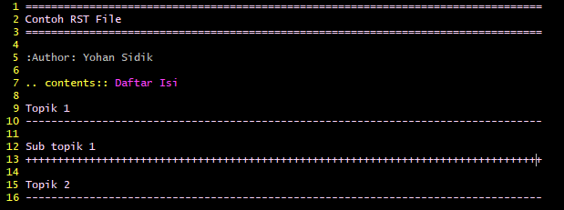
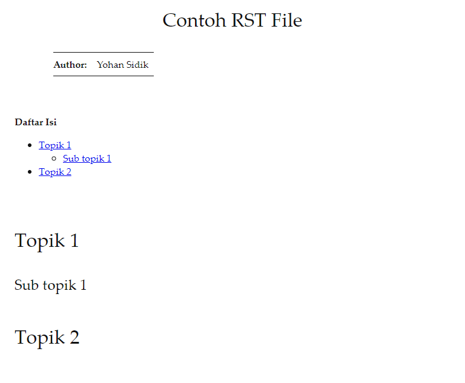

# Docutils

Repository ini berisi template untuk mengubah rst file ke html menggunakan
docutils.

## Install Docutils

- Install Python
- Install [docutils](https://pypi.org/project/docutils/)

## Contoh File

- [contohRST.rst](contohRST.rst)



- [convert.py](convert.py)

```
$ rst2html.py --stylesheet=docutils_basic.css contohRST.rst contohRST.html
```

## Hasil Konversi

- [contohRST.html](contohRST.html)


