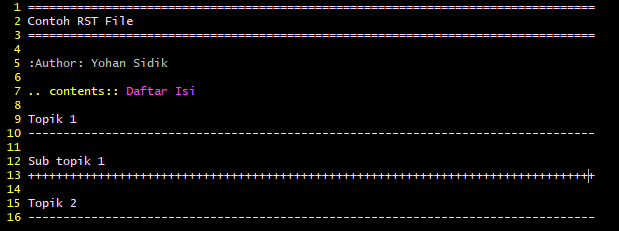

Docutils
=================================================================================

Repository ini berisi template untuk mengubah rst file ke html menggunakan
docutils.

.. contents:: Daftar Isi

Install Docutils
---------------------------------------------------------------------------------

- Install Python
- Install `docutils <https://pypi.org/project/docutils>`_

Contoh File
---------------------------------------------------------------------------------

- `contohRST.rst <contohRST.rst>`_

- `convert.py <convert.py>`_

::

        $ rst2html.py --stylesheet=docutils_basic.css contohRST.rst contohRST.html

Hasil Konversi
---------------------------------------------------------------------------------

- `contohRST.html <contohRST.html>`_

.. image:: contohHTML.PNG

Stylesheet
---------------------------------------------------------------------------------

- `docutils-css <https://github.com/matthiaseisen/docutils-css>`_
- `github-pandoc.css <https://gist.githubusercontent.com/dashed/6714393/raw/ae966d9d0806eb1e24462d88082a0264438adc50/github-pandoc.css>`_

